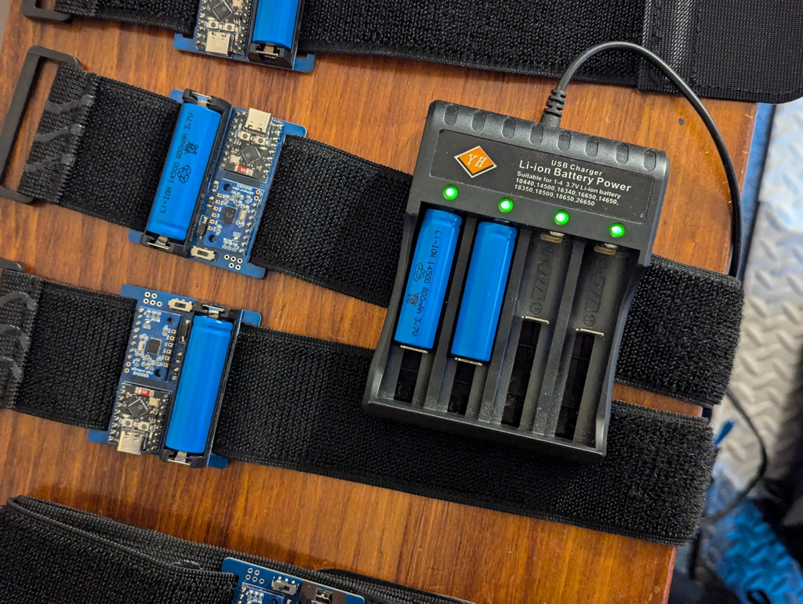

# Arctic Slime
A SlimeVR Tracker Design by nethesem. This page is a work in progress.

Arctic Slime is inspired by Frozen Slime, designed to be a PCB-based tracker that does not require a case, but addresses the main drawbacks of Frozen. Arctic aims to take advantage of the Li-Ion cell as a way of ditching integrated charging, reducing the number of components and making the charging process as simple as slapping the cells into external chargers. The 14500 (size of a AA) cell is significantly smaller than an 18650, making the overall design extremely simple and compact.

 - Compact deisn around C3 SuperMini
 - Compatible with common BMI and 'official' BNO IMUs
 - Diode protection and Batt Level Sense
 - 50mm strap loops to fit common cargo straps

Special thanks to;
[frosty6742](https://github.com/frosty6742/frozen-slimes-v2/commits?author=frosty6742) - Frozen Slime concept, I think the PCB with integrated strap loops is a really cool idea.
[gorbit99](https://github.com/gorbit99/tiny-slime/commits?author=gorbit99) - I basically copied TinySlime's SuperMini pinout and batt sense setup, and have heavily plagiarized the TinySlime ReadMe.

## Design considerations

The 14500 3.7v Li-ion cell is an oddball size that is difficult to find and not massively space efficient. The point of the 18650 used in Frozen is that they're big capacity and available everywhere. Genuine 14500s are neither of those. I use 800mAh cells, I think 1000mAh is possible, but anything more than that is likely a fake in this form factor. As such, these trackers are generally good for about 8hrs run time - not great, but they're also a lot less hassle to charge than most slimes.

The C3 SuperMini has a terrible antenna, meaning you will need your wireless access point / router to be in the same room. Batt sense for the SuperMini also seems to be broken in software, but this should get fixed in a future firmware update. I plan to make available a D1 Mini version of this tracker that is slightly larger, but allows Ol' Reliable to be used if you want more stability.

A case-less tracker like this looks very cool and doens't need 3D printed parts, but is also very exposed. I plan to design an optional 'clip-on cover' at some point, but for now, don't sit on one of these during use.

## BOM

| Part                                  | Count | Source                                                                |
| ------------------------------------- | ----: | --------------------------------------------------------------------- |
| Arctic Slime PCB                      |     1 | JLCPCB                                                                |
| Supermini ESP32C3                     |     1 | [AliExpress](https://www.aliexpress.com/item/1005005877531694.html)\* |
| BMI shaped IMU                        |     1 | [KOUNOLAB](https://store.kouno.xyz)  or  [AliExpress](https://www.aliexpress.com/item/4000052683444.html)   |
| PCM12 compatible switch               |     1 | [AliExpress](https://www.aliexpress.com/item/4000685483225.html)      |
| SS34 diode                            |     1 | [AliExpress](https://www.aliexpress.com/item/1005002813143363.html)   |
| 1206 100k Ω resistor                  |     2 | [AliExpress](https://www.aliexpress.com/item/1005006358156511.html)\* |
