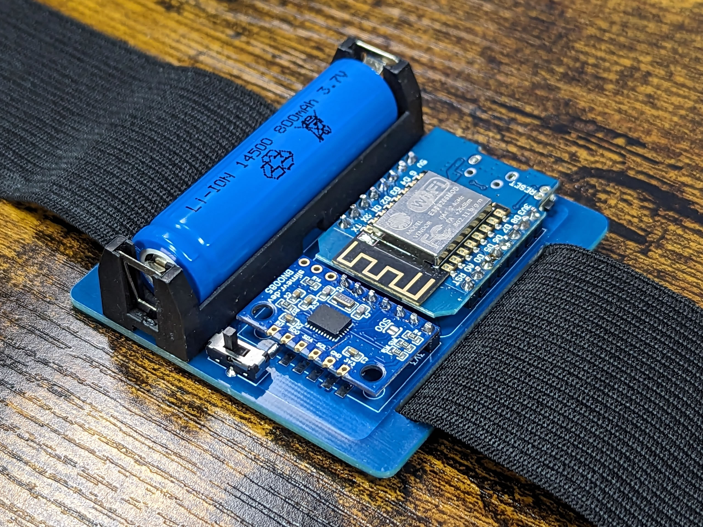
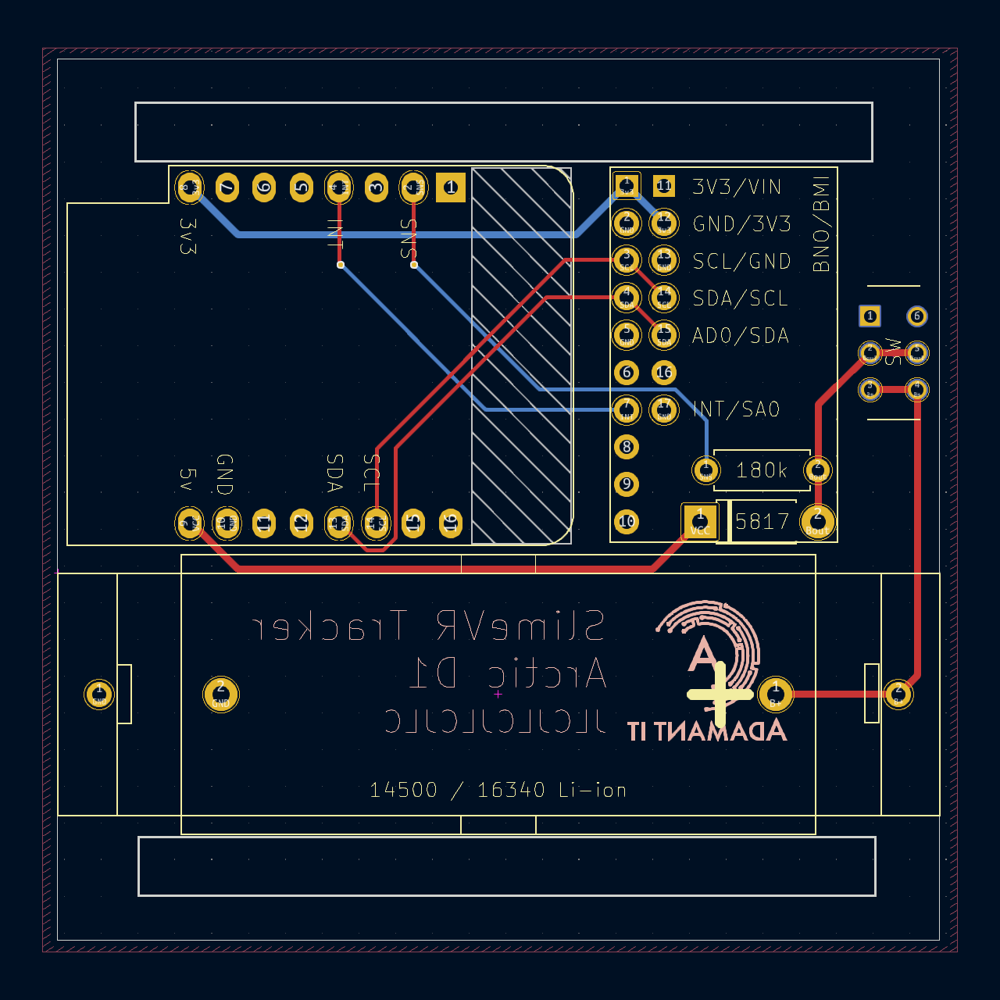
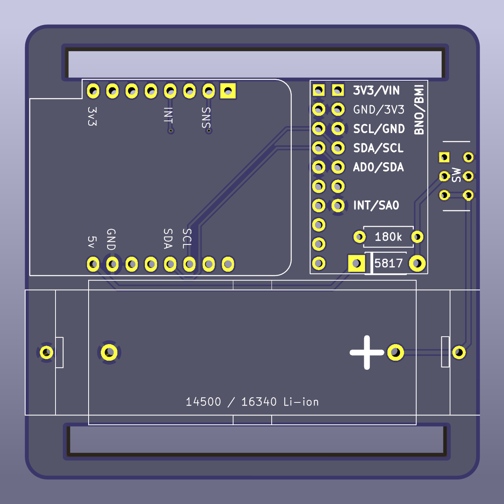

# Arctic Slime
A SlimeVR Tracker Design by nethesem. This page is a work in progress.

Arctic is designed to be a PCB-based tracker that does not require a case. Arctic aims to take advantage of the Li-ion cell as a way of ditching integrated charging, reducing the number of components and making the charging process as simple as dropping the cells into external chargers. Li-ion cells come in more standardised sizes, which makes them easier to find within your country and saves the several week wait for Aliexpress cells.

The regular Arctic accepts 14500 (size of a AA) or 16340 cells, making the overall design extremely simple and compact. The Arctic "XL" version has an extended footprint to fit the ubiqutous 18650, which may be useful for people who either want the high-capacity that 18650 can offer, or if they're unable to obtain other cell sizes.

Special thanks to [frosty6742](https://github.com/frosty6742/frozen-slimes-v2/commits?author=frosty6742), who designed Frozen Slime which was my inspiration for this, and [gorbit99](https://github.com/gorbit99/tiny-slime/commits?author=gorbit99), whose TinySlime design I used to make a C3 Supermini version of Arctic.

 - Case-less design requires no 3D printing
 - Compatible with common BMI and 'official' BNO IMUs
 - Diode protection and Batt Level Sense
 - 50mm strap loops to fit common cargo straps
 - Removable Li-ion cell, to be charged in any common Li-ion charger

## Board View

## Miscellaneous versions

Development prototypes used the C3 Supermini ESP board, which further reduces the size of the tracker. However, the supermini has an extremely poor antenna, limiting the range of the tracker to "within a few meters of your router" for reliable performance. As such I made the final version slightly bigger for a D1 Mini. But if you want to build the Supermini version and have a solution to the antenna, the files are available in the Misc Versions folder.

## BOM

| Part                                  | Count | Source                                                                       |
| ------------------------------------- | ----: | ---------------------------------------------------------------------------- |
| Arctic Slime PCB                      |     1 | Download Here, Order from JLCPCB                                             |
| ESP-12F D1 Mini                       |     1 | [AliExpress](https://aliexpress.com/item/1005006444397823.html)              |
| IMU*                                  |     1 | [BMI270](https://store.kouno.xyz) or [BNO085](https://shop.slimevr.dev/products/slimevr-imu-module-bno085) |
| 14500 Battery**                       |     1 | [Overlander](https://overlander.co.uk/800mah-3-7v-14500-li-ion-battery.html) |
| 14500 Battery Holder                  |     1 | [AliExpress](https://www.aliexpress.com/item/1005006254465094.html)          |
| 16340 Battery**                       |     1 | ???                                                                          |
| 16340 Battery Holder                  |     1 | [AliExpress](https://aliexpress.com/item/1005005873648134.html)              |
| 1N5817 diode                          |     1 | [AliExpress](https://aliexpress.com/item/1005002813143363.html)              |
| 1/4w 180kΩ resistor                   |     1 | [AliExpress](https://aliexpress.com/item/1005006358156511.html)              |
| MSS22D18 Switch                       |     1 | [AliExpress](https://aliexpress.com/item/4000699811538.html)                 |

*Any IMU that is pin compatible with the two listed options should also work, such as LSM varieties or the BMI160. BNO085 and BMI270 are my current reccomendations.

**Select the size you want to use. 14500 and 16340 cells are similar in capacity. The 14500 is slightly lower-profile, reducing the height of the tracker. Use whichever are more easily available to you, look for Vape, RC, or Flashlight shops that stock Li-ion cells in your country. Aliexpress Li-ion cells are a dice roll, aim for 800mAh for a realistic capacity.

## Assembly

Assembly video goes here

## Flashing

Trackers can be flashed using the SlimeVR online firmware tool. I reccomend the [Butterscotch version](https://slimevr-firmware.bscotch.ca/), and most settings can be left at default values except for FW Version, Board, and IMU.

 - Firmware Version:
   - For BNO085 or BMI270, use SlimeVR/main. Other IMUs, consult SlimeVR Discord.*
 - Board should be "BOARD_WEMOSD1MINI"
   - SDA Pin: D2
   - SCL Pin: D1
   - LED Pin: 2
 - Primary IMU: Select as appropriate
   - If BNO085, INT Pin: D5
 - Secondary IMU: Uncheck**
 - Battery Sense should be BAT_EXTERNAL
   - Battery Shield Resistance: 180
   - Battery Shield R1: 100
   - Battery Shield R2: 220
   - Battery Sense Pin: A0

*I reccomend checking in with the SlimeVR Discord regardless of what IMU you're using, as they will always know the most up-to-date firmware.

**Aux / Secondary IMU: This PCB does not support Aux IMUs. Given the low-capacity batteries and already compact PCB, it's not a good match up. You can jumper-wire aux wires from the pins of the main IMU if you really want, but there are no plans to add support for this.
