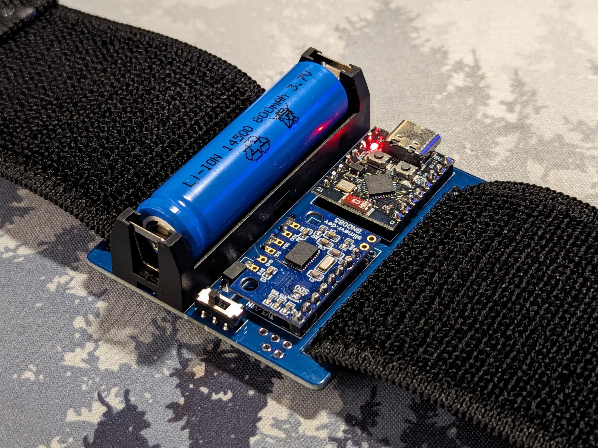

# Misc Versions
## XL (18650) edition
The XL version has extended tabs to accomodate an 18650 footprint. This can be useful as the 18650 cell can offer very high capacity (up to 3000mAh) for exceptionally long run time. The 18650 is also an extremely common Li-ion cell, purchasable from many places and also easy to scavage from old laptop batteries and powerbanks, making it a great candidate if you simply cannot get other Li-ion / Li-po cells.

Note that the 18650, along with being physically large, will also be noticably heavier than other cells, which can affect stability.

## C3 Supermini edition
The C3 Supermini is significantly smaller than a D1 Mini, allowing for a 9mm reduction of the total width (50mm vs 59mm). This version is 14500 only, since it's designed to be as small as possible.

The C3 Supermini's antenna is very bad, so this version is not viable unless you have a decent router within a few meters of your playspace. There is a new version of the C3 Supermini with an external antenna connector that can drastically improve signal strength, but I haven't yet tested it so try at your own risk.

| Part                                  | Count | Source                                                                       |
| ------------------------------------- | ----: | ---------------------------------------------------------------------------- |
| Arctic Slime PCB                      |     1 | JLCPCB                                                                       |
| Supermini ESP32C3                     |     1 | [AliExpress](https://aliexpress.com/item/1005005877531694.html)              |
| IMU                                   |     1 | [BMI270](https://store.kouno.xyz) or [BNO085](https://shop.slimevr.dev/products/slimevr-imu-module-bno085) |
| AA Battery Holder                     |     1 | [AliExpress](https://www.aliexpress.com/item/1005006254465094.html)          |
| 14500 Battery                         |     1 | [Overlander](https://overlander.co.uk/800mah-3-7v-14500-li-ion-battery.html) |
| 1N5817 diode                          |     1 | [AliExpress](https://www.aliexpress.com/item/4000204938838.html)              |
| 1/4w 100kΩ resistor                   |     2 | [AliExpress](https://aliexpress.com/item/1005006358156511.html)              |
| MSS22D18 Switch                       |     1 | [AliExpress](https://aliexpress.com/item/4000699811538.html)                 |

## Flash Settings for C3 Supermini edition
This PCB is configured in the same way as the TinySlime, you can select TinySlime as the Board type to auto-set the parameters. When flashing, hold the BOOT button on the C3 SuperMini as you connect the USB cable to ensure its in Flash Mode, otherwise flashing will likely fail.

 - Firmware Version:
   - For BNO085 or BMI270, use SlimeVR/main. Other IMUs, consult SlimeVR Discord.
 - Board should be "BOARD_LOLIN_C3_MINI"
   - SDA Pin: 6
   - SCL Pin: 7
   - LED Pin: 8
 - Primary IMU: Select as appropriate
   - If BNO085, INT Pin: 5
 - Secondary IMU: Uncheck (see below)
 - Battery Sense should be BAT_EXTERNAL
   - Battery Shield Resistance: 0
   - Battery Shield R1: 100
   - Battery Shield R2: 100
   - Battery Sense Pin: 1
